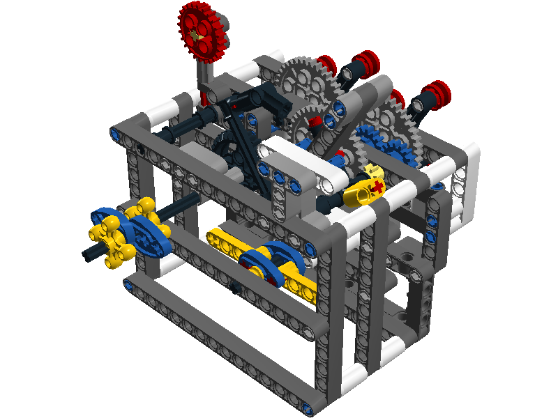

# Useless Machine - LEGO Technic

The purpose of a Useless Machine is to turn itself off when activated. Kits and built examples are available for purchase. While researching I found LEGO models but without kits or instructions.

Challenge accepted!

<!--truncate-->

I completed the model in March of 2017 and revised it today.

Without a parts list or instructions I decided to reverse engineer the device from the following video:
[[011] Lego Technic - Useless Machine](https://www.youtube.com/watch?v=HAk-rhvZe2w)

I created a model using LEGO Digital Designer (LDD) before buying the parts. [Download the LXF model](./UselessMachine.lxf)

Using LDD I generated a PDF with building instructions and a parts list at the end.
[Download the PDF instructions](./UselessMachineInstructions.pdf)

> NOTE: The model and instructions do not include the LEGO Pull Back MOTOR 6x5x3! It was not available in the LDD.

Here is the model at the final step of assembly

