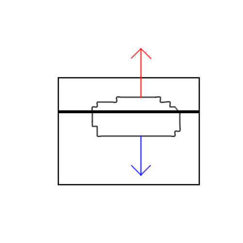

# Does melting ice really cause sea levels to rise?

I saw a documentary that claimed melting polar ice caps are causing sea levels
to rise. Something was fishy about that claim so I made some simplifying
assumptions, drew a free body diagram and started doing algebra. I won't
reproduce the algebra here because it turns out there is a common sense way to
reach the same conclusion.

<!--truncate-->

## Simplifying assumptions
- No saltwater
- Ice is pure water
- No condensation
- No evaporation

## Free body diagram

> not drawn to scale

## Common sense
Since the system is in equilibrium the buoyancy force (red) is equal in
magnitude to the gravitational force (blue). 

Under the force of gravity the ice will displace some volume of water. `The mass
of the displaced volume of water must be equal to the mass of the ice causing
that water to be displaced.` Therefore, the water from the melted ice has the
same volume as the water originally displaced! The water level will not change!

Wait a minute! How do we know that `The mass of the displaced volume of water
must be equal to the mass of the ice causing that water to be displaced.`?
Well, picture this: gravity is applying to a body of water. Pushing against the
water causes an equal-magnitude and opposite-direction reaction. The more water
is displaced the greater reaction force. You are pushing against gravity!

This is the buoyancy force!

The force an object can exert due to gravity on a body of water is determined by
its mass. That object will sink if the force exerted by the object is greater
than the buoyant force. In other words: if the mass of the object is greater
than the mass of the object's volume in water then the object sinks. 

If the mass of an object is less than the mass of the object's volume in 
water... then the object sinks.

In other words, objects denser than water sink, objects less dense than water
float.

## Back to saltwater

In the previous discussion the medium of floatation was the same as the object
of displacement. In other words: ice (frozen h20) is floating in water (liquid 
h20). Liquid water has the same properties as liquid water; including density.

So what happens to the fluid level when ice (frozen h20) floating in saltwater
melts?

I leave this as an exercise for the reader.
